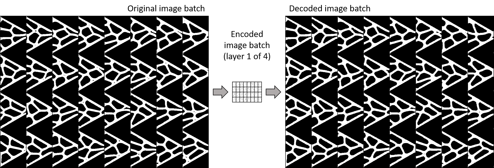
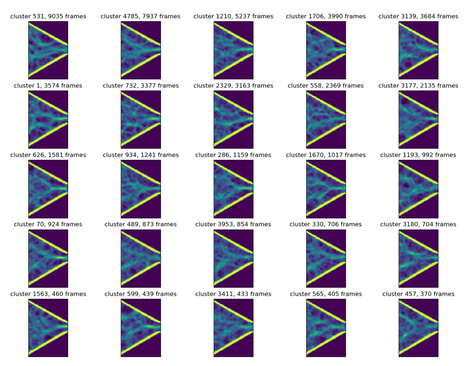
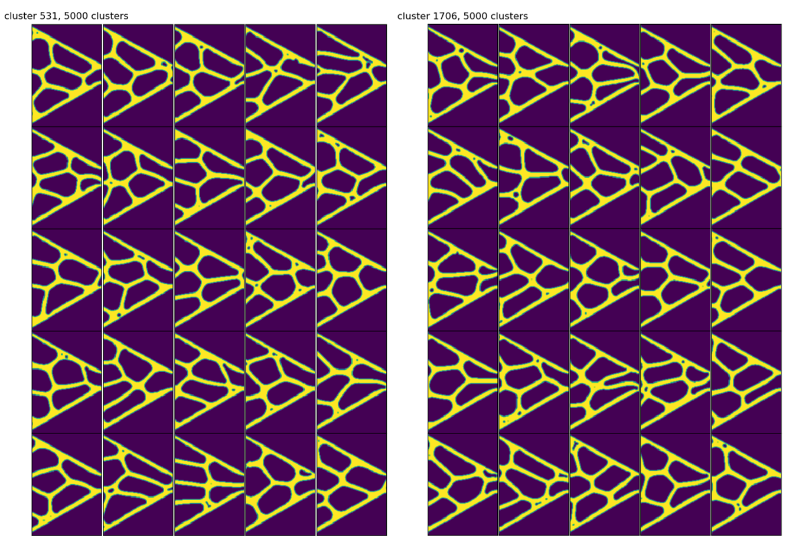

# Tang Analysis Codes

Consolidation of Tang analysis codes written in Python and MATLAB for processing videos of droplets and stentor cells and for applying machine learning. 

## Droplet Analysis
Python modules are given to pick up some of the previously written MATLAB codes. 

### For Python examples...
See the *write_all_frames_to_dictionary.py* code for notes on setting up your working directory and *example_code.py* for some examples on implementation of methods and prodcuing figures like the ones seen below.

#### Figures produced from Python processing suite
Marked-up frame:  

Combining contour frame:  

## Machine Learning
A starter pack for lab members to apply machine learning to their projects. A good starting point is *conv_nets.py* for predicting droplet breakup that relies heavily on *data_utils.py* for extracting preprocessed frames to set up the data structure. Again, see *write_all_frames_to_dictionary.py* for reference on setting up working directories. Modules are written using PyTorch.

#### Convolutional autoencoder

#### Clustering by fully connected layer of encoded image
Mean image of 20 frames in given clusters (5000 total clusters)

Random sampling of two clusters

## Miscellaneous
Additional data anlaytics codes for reading and processing large text files from PMT signals, for example.

## Notes on Python environment
The codebase was developed using Python (3.6.5), OpenCV (version 3.4.1), PyTorch (version 0.4.0). All other modules should also be current and would come standard with Spyder or PyCharm IDEs.

### Happy coding!
